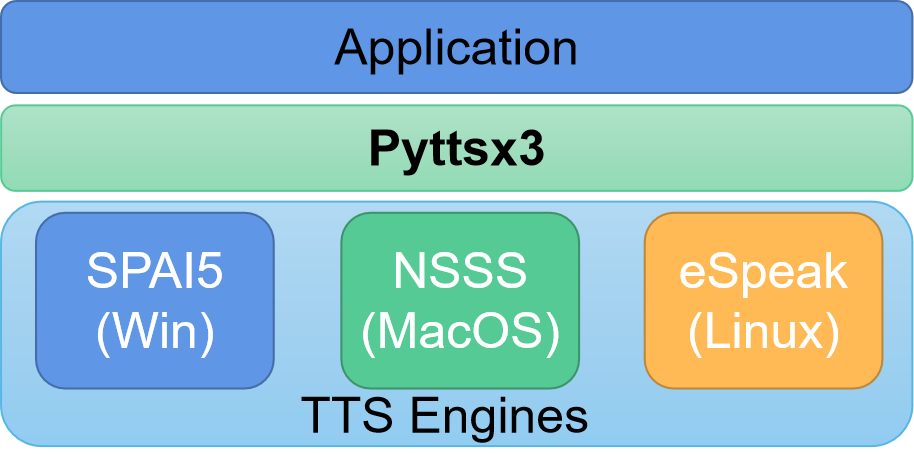
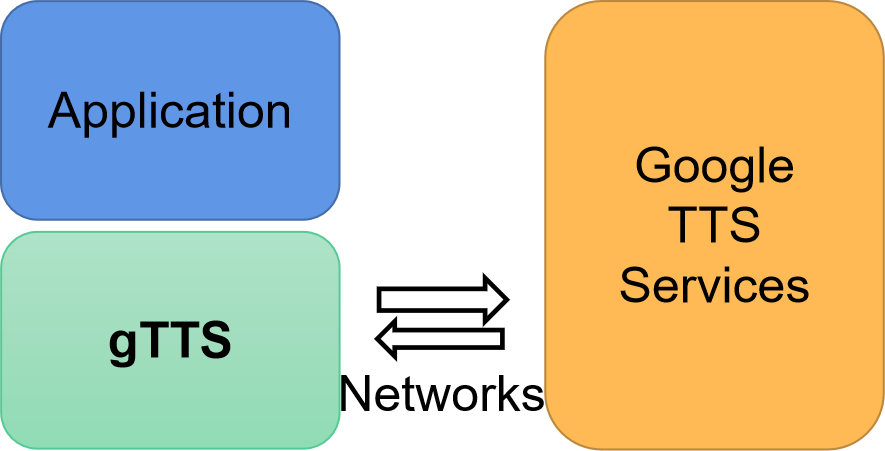

# Text to Speech demos
>Text-to-speech (TTS) is a technology that converts written text into spoken words or audio output.

There are two mainstream python TTS libraries: pyttsx3 and gTTS.

## Pyttsx3

Pyttsx3 is a text-to-speech conversion library in Python. Unlike alternative libraries, it works offline, compatible with both Python 2 and 3 and cross-platform.

## gTTS
gTTS (Google Text-to-Speech), a Python library and CLI tool to interface with Google Translate's text-to-speech API. Write spoken mp3 data to a file, a file-like object (bytestring) for further audio manipulation, or stdout.

**Notice**:TTS demos based on both pyttsx3 and gTTS have been uploaded to this fold.